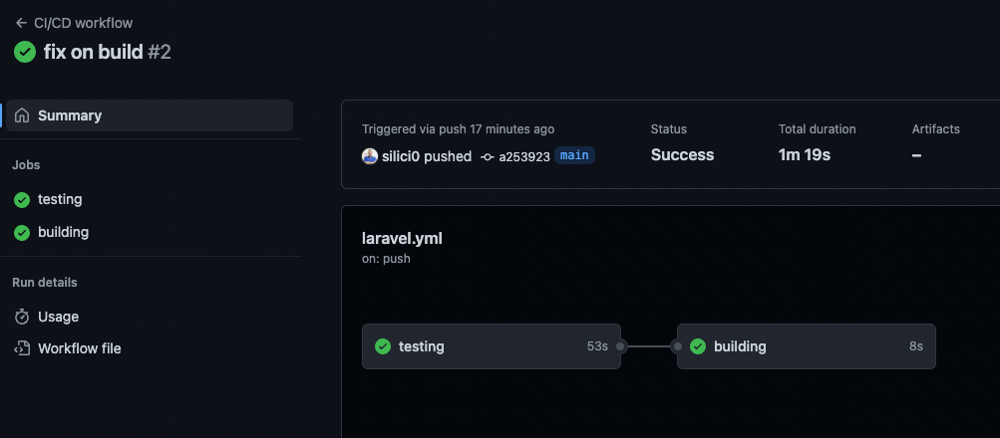
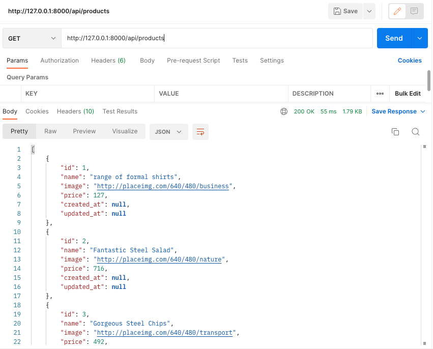
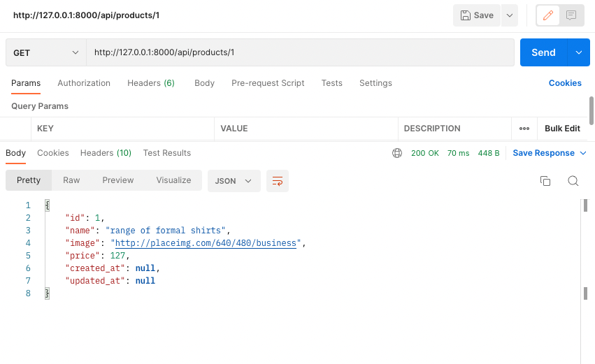

## Devnology Fullstack Test

De acordo com proposto foi criado dois endPoint api para listagem de produtos e visualização de dados produtos, send 
/api/products e /api/products/1, seguindo TDD, Repository Pattern, feito pipeline para Testes :



Para instalar o projeto Laravel foi usado Laravel 9.52.4, PHP 8.0.24 e Mysql 8.0.28 baixa baixar o projeto e rodar 
comando :

```bash
composer install
```

Criar o arquivo .env apartir do exemplo

```bash
cp .env.example .env
```
Gerar chave para o projeto

```bash
php artisan key:generate
```

Configurar as variáveis da database mysql

```bash
DB_CONNECTION=mysql
DB_HOST=127.0.0.1
DB_PORT=3306
DB_DATABASE=database
DB_USERNAME=root
DB_PASSWORD=pass
```

Geração de base de dados e seed de dados a partir da url de dados previamente enviada

```bash
php artisan migrate:fresh --seed
```

Execução de Testes

```bash
php artisan test
```

Para rodar o projeto

```bash
php artisan serv
```

Exemplo de requisições:




